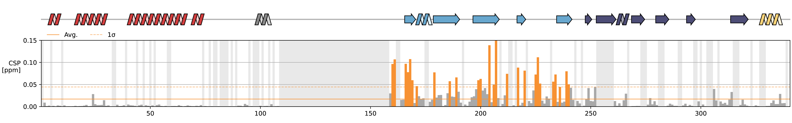

<h1 align="center">
  <br>
  
  <br>
  <b>EchoFox</b>
  <br>
</h1>

<p align="center">
  <a href="https://pypi.org/project/echofox/"></a>
  <a href="https://pypi.org/project/echofox/"></a>
  <a href="https://www.biozentrum.unibas.ch/research/research-groups/research-groups-a-z/overview/unit/research-group-sebastian-hiller"></a>
</p>

---

## General Information

Welcome to the EchoFox repository!

EchoFox is a Python package developed by the Hiller group at the University of Basel for processing, analyzing, and plotting biomolecular data. The package provides tools for quickly generating clean, publication-ready figures from NMR data.

In addition to NMR-related functionality, EchoFox also includes scripts and utilities for working with data from other common biophysical techniques, such as chromatography runs, ITC experiments, and DSF melting curves. The goal of the project is to make routine data analysis and plotting faster and simpler within the lab and for anyone else who finds it useful.

## Installation

The latest main release of EchoFox can be installed using pip:

```bash
python -m pip install echofox
```

## Short examples

```python
import echofox as ef

# Set up plot
fig, axs = ef.make_plot(
    2, 1, size=(45, 12),
    layout="constrained",
    gridspec_kw={'height_ratios': [1, 5]}
)

# Draw secondary structure 
nk.draw_secondary_structure(
    axs[0], "3agx", range=(1, 1+len(seq)),
    domain_color_map=[
      {"name": "JD", "range": [0, 78], "color": "#d23d3d"},
      {"name": "GF", "range": [79, 158], "color": "#888888"},
      {"name": "CTD1", "range": [159, 246], "color": "#68a7ce"},
      {"name": "CTD2", "range": [247, 323], "color": "#4d4d76"},
      {"name": "DD", "range": [324, 340], "color": "#fcd479"},
  ]
)

# Import peak lists
df_ref = ef.import_assignment("reference.xlsx")
df_comp = ef.import_assignment("compare.xlsx")

# Plot CSPs
axs[1] = ef.plot_csps(
    axs[1], df_ref, df_comp,
    bars_kwargs = {
      "width": 1.05,
      "linewidth": 0.0,
      "edgecolor": "black",
    },
    ylim = (0, 0.15)
)

ef.block_missing_res(axs) # Add grey bars for missing residues

ef.save_plot("my_plot", formats=["png", "pdf"], dpi=300) # Export plot
```




## License

- [**GPL-3.0 license**](https://github.com/hiller-lab/EchoFox/blob/main/LICENSE)